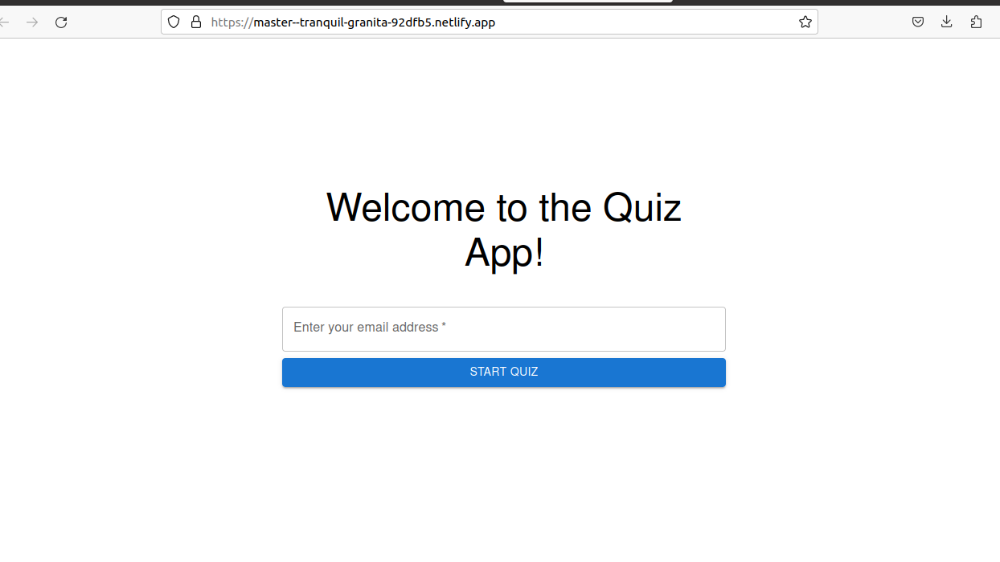
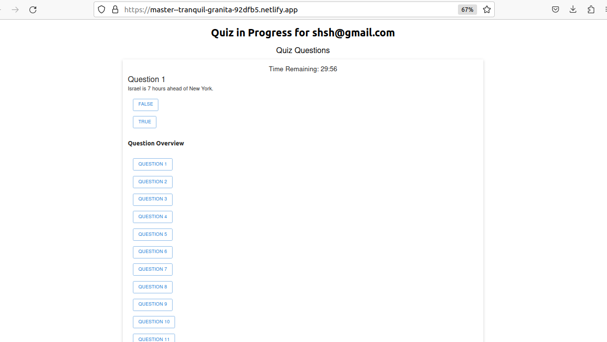

# React Quiz Application

## Overview

This is a simple React quiz application that allows users to take a quiz, navigate through questions, and see a report of their quiz results. The application includes a timer that counts down from 30 minutes and auto-submits the quiz when the timer reaches zero.

### Components

The application consists of the following main components:

- **Quiz**: The main component that handles quiz navigation and user interactions.
- **Timer**: A component displaying a countdown timer at the top of the quiz page.
- **QuestionOverview**: A panel that shows an overview of the quiz questions, indicating which questions have been visited and which have been attempted.

## Application Screenshots




## Installation

To run this application locally, follow these steps:

1. Clone this repository to your local machine:

   ```bash
   git clone https://github.com/Shashank12300/Quiz_App


## Assumptions

- This application assumes that the user interface is primarily designed for desktop or larger screens. For mobile responsiveness, additional CSS styling and adjustments may be needed.

## Challenges Faced

- One challenge faced during development was managing the quiz state, including tracking visited and attempted questions, and handling the timer logic.
- Implementing the confirmation dialog when users attempt to navigate away from a question with a selected answer required custom logic and handling user interactions.


## Available Scripts

In the project directory, you can run:

### `npm start`

Launches the test runner in the interactive watch mode.\
See the section about [running tests](https://facebook.github.io/create-react-app/docs/running-tests) for more information.

### `npm run build`

Builds the app for production to the `build` folder.\
It correctly bundles React in production mode and optimizes the build for the best performance.


## Learn More

You can learn more in the [Create React App documentation](https://facebook.github.io/create-react-app/docs/getting-started).

To learn React, check out the [React documentation](https://reactjs.org/).

### Code Splitting

This section has moved here: [https://facebook.github.io/create-react-app/docs/code-splitting](https://facebook.github.io/create-react-app/docs/code-splitting)

### Analyzing the Bundle Size

This section has moved here: [https://facebook.github.io/create-react-app/docs/analyzing-the-bundle-size](https://facebook.github.io/create-react-app/docs/analyzing-the-bundle-size)

### Making a Progressive Web App

This section has moved here: [https://facebook.github.io/create-react-app/docs/making-a-progressive-web-app](https://facebook.github.io/create-react-app/docs/making-a-progressive-web-app)

### Advanced Configuration

This section has moved here: [https://facebook.github.io/create-react-app/docs/advanced-configuration](https://facebook.github.io/create-react-app/docs/advanced-configuration)

### Deployment

This section has moved here: [Deployed Quiz App Link](https://master--tranquil-granita-92dfb5.netlify.app/)
